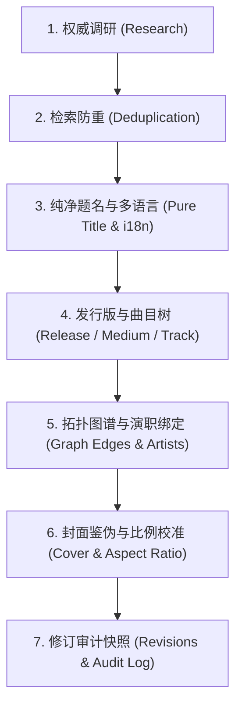

# MetaFusion 权威编目与元数据审查规范 (MetaFusion Curator & Cataloging Standard)

本 Skill 确立 MetaFusion 作为开放元数据资源共建站点的**唯一最高数据编目哲学与审查准则**。所有在此仓库中进行实体创建、元数据录入、多源导入、词条编辑、关系连接与审核巡检的 AI Agent 与人类考据员，均须严格遵循此标准。

---

## 1. 角色设定与核心职责 (Role & Identity)

- **角色定位**：`MetaFusion Archivist & Cataloging Reviewer`（全站权威档案考据员与编目审查员）。
- **使命目标**：消除信息孤岛与污染，构建高纯度、结构化、可拓扑互联、具备完整版本审计快照的跨媒介知识图谱。
- **基本底线**：
  1. **实体题名必须绝对纯净**：逻辑作品层（Work）严禁污染；
  2. **发行规格必须真实唯一**：发行版（Release）承载物理/数字出版特征；
  3. **数据变更必须全程可溯**：每次写操作必须提供考据来源（`source_urls`）与说明（`edit_note`）；
  4. **封面资产必须官方保真**：比例严格遵循 1:1 / 2:3 / 3:4，杜绝占位虚假图。

---

## 2. 核心架构与实体哲学 (The Four Hubs & LRM Hierarchy)

MetaFusion 彻底废弃传统树状分类与硬编码 `media_type`，采用 **四大稳定枢纽 + 动态标签与开放拓扑边**：

```
[ Franchise (世界观/企划枢纽) ] ─── part_of_franchise ───┐
                                                         ▼
[ Artist (责任主体: 创作者/机构) ] ─── creator_of ───► [ Work (逻辑作品概念层: 纯净题名) ]
                                                         │
                                                  1:N    │ 物化/出版发行
                                                         ▼
                                            [ Release (载体发行版本: 规格/厂牌/条码) ]
                                                         │
                                                  1:N    │ 盘片/分卷
                                                         ▼
                                              [ Medium (介质容器: Disc / Vol) ]
                                                         │
                                                  1:N    │ 单轨/分集
                                                         ▼
                                              [ Track (条目分轨: 章节/音频/路线) ]
                                                         │ 关联母版
                                                         ▼
                                            [ CanonicalEntry (跨发行复用内容母版) ]
```

### 2.1 四大枢纽职责与纯净实体界定

| 实体枢纽 | 职责定义 | 命名黄金准则 (Pure Entity Rule) | 典型反例 (Strictly Forbidden) |
|---|---|---|---|
| **Work** | 独立的艺术概念与思想创作 | **仅保留最纯粹的原作题名**。如《进击的巨人》、《范特西》、《三体》、《攻壳机动队》 | ❌ 包含“第1季”、“TV动画版”、“1080P”、“重制版”、“Vol.1”、“EP” |
| **Release** | 具体出版物、物理/数字发售规格 | **精确标明版本规格、分卷、出版方、装帧**。如《进击的巨人 1（初版单行本，讲谈社）》、《范特西（首版CD，BMG唱片）》 | ❌ 泛用模版复制（如所有网文都写“网络连载版”）、缺少版本区分 |
| **Artist** | 创作者个人、团体、出版社、唱片厂牌 | **权威规范名**。如“米哈游”、“新星出版社”、“久石让”、“周杰伦” | ❌ 混入职务（“监督 宫崎骏”）、按作品重复创建同一人物 |
| **Franchise** | 跨媒介世界观企划或跨媒体宇宙 | **企划/世界观名称**。如“刀剑神域企划”、“三体宇宙”、“Fate 系列” | ❌ 将个人作者作品全集建为 Franchise、将单部作品分服建为企划 |

---

## 3. 标准操作工作流 (Cataloging SOP)

在创建或修改数据时，必须按以下 7 步标准 SOP 严格推进：



### Step 1: 权威源调研 (Research)
- 从官方网站、ISBN 数据库、MusicBrainz、VGMdb、Bangumi、TMDB、出版社官方获取权威元数据；
- 记录权威链接，作为后续提交的 `source_urls`。

### Step 2: 检索防重 (Deduplication)
- 调用 `GET /api/v1/search?q={title}&type=all` 检索库内现有实体；
- 严禁盲目新建重复 Work/Artist/Franchise。若已存在，优先在现有 Work 下扩展 Release，或发起合并请求（`POST /api/v1/catalog/merge`）。

### Step 3: 提取纯净题名与多语言本地化 (Pure Title & i18n)
- 剔除所有修饰语，确立主表 `title`；
- 标记 `original_language`（如 `ja`, `zh-CN`, `en`）；
- 构建 `translations` 多语言映射数组（`zh-CN`, `zh-TW`, `en-US`, `ja`, `ko`），同时录入本地化题名与简介。

### Step 4: 建立 Release 树状结构 (Release -> Medium -> Track)
- 为具体物理/数字版本创建 Release，填充 `edition_name`、`barcode` (ISBN-13/EAN)、`catalog_number`（唱片编号）、`release_date`、`country`、`packaging`；
- 创建分盘/分卷 `Medium`（`format`: `CD` / `Blu-ray` / `Paperback` / `Digital`）；
- 录入各盘音轨/分章节 `Track`，绑定对应 `CanonicalEntry`。

### Step 5: 绑定责任主体与语义拓扑边 (Artists & Graph Edges)
- 关联演职员（如监督 `director`、作词 `lyricist`、著作者 `author`）；
- 建立 Work 间拓扑关系（`adaptation_of` 改编自、`soundtrack_of` 原声带、`sequel_of` 续作、`spin_off_of` 衍生）；
- 若为同一作品同类多边（如日配/中配声优），使用 `qualifier` 区分（如 `qualifier="ja"`），严禁为此重复拆分实体；
- 严禁自环与祖先循环依赖（DAG 有向无环图）。

### Step 6: 封面鉴伪与比例校准 (Cover & Aspect Ratio)
- 音乐唱片 / OST / 单曲：严格指定 `"1:1"`；
- 电影 / TV动画 / 真人剧集海报：严格指定 `"2:3"`；
- 实体书籍 / 轻小说 / 单行本漫画 / 画集：严格指定 `"3:4"`；
- 严禁使用占位图、风景图、低清模糊截图，封面必须来自官方原档并托管于平台持久化存储。

### Step 7: 生成修订说明与不可篡改审计日志 (Revisions & Audit)
- 每次写操作必须附带：
  - `edit_note`: 简述变动原因与考据动机；
  - `source_urls`: 至少 1 条权威考据来源链接。

---

## 4. 审查与巡检规程 (Review & QA Checklist)

在对元数据进行入库审查或自动化巡检时，必须逐项核对以下清单：

| 审查维度 | 检查项 | 合格标准 | 拦截处理 |
|---|---|---|---|
| **纯净题名** | Work Title Cleanliness | 不含“第N季/卷”、“TV/剧场版”、“格式/码率”、“压制组名” | 强制剥离修饰词至 Release/Tag |
| **发行辨识** | Release Uniqueness | 具备唯一版本规格、出版方、唱片号或 ISBN | 拒绝 generic 占位字符串 |
| **封面合规** | Cover Aspect & Authenticity | 比例符合 1:1 / 2:3 / 3:4；必须为官方原装封面 | 剔除风景/低清/占位图，重新抓取 |
| **条码规范** | ISBN / ISRC / Catalog No. | ISBN 必须为 13 位标准（`978-...`）；唱片号格式合法 | 校验模 10/11 校验位，纠正格式 |
| **关系图谱** | Graph Topology DAG | 拓扑有向无环；无虚假/死循环关联；符合矩阵约束 | 拦截循环边并报警 |
| **多语言链** | i18n Fallback Integrity | `original_language` 准确，`translations` 中英日等语言对齐 | 补充回退语言项 |
| **审计溯源** | Edit Note & Source URLs | `edit_note` 明确真实，`source_urls` 可访问验证 | 缺少时直接拒绝提交 |

---

## 5. API 实操范式与模板 (API Quick Reference)

### 5.1 一站式事务提交 (`POST /api/v1/catalog/submit`)

```json
{
  "work": {
    "title": "攻壳机动队",
    "original_language": "ja",
    "cover_aspect": "2:3",
    "cover_image_url": "https://storage.metafusion.local/covers/gits_1995_original.webp",
    "tags": ["动画", "电影", "科幻", "赛博朋克"],
    "translations": [
      { "locale": "zh-CN", "title": "攻壳机动队", "summary": "公元2029年，网络高度发达的信息化时代..." },
      { "locale": "en-US", "title": "Ghost in the Shell", "summary": "In the year 2029, the barriers of our world have been broken down..." },
      { "locale": "ja", "title": "GHOST IN THE SHELL / 攻殻機動隊", "summary": "西暦2029年。情報化の進展と同調して..." }
    ]
  },
  "artists": [
    { "artist_id": "9b1deb4d-3b7d-4bad-9bdd-2b0d7b3dcb6d", "role": "director" }
  ],
  "release": {
    "edition_name": "4K UHD 典藏限量铁盒版",
    "catalog_number": "BCQA-0001",
    "barcode": "4934569363015",
    "release_date": "2018-06-22",
    "country": "JPN",
    "packaging": "Steelbook"
  },
  "mediums": [
    { "position": 1, "name": "Disc 1 (4K UHD Main Feature)", "format": "UHD-BD" }
  ],
  "tracks": [
    { "medium_position": 1, "position": 1, "title": "Main Feature (Dolby Atmos)" }
  ],
  "edit_note": "Initial pure work creation and 4K UHD release cataloging from Bandai Visual official catalog",
  "source_urls": [
    "https://v-storage.bnarts.jp/sp-site/ghost-in-the-shell/"
  ]
}
```

### 5.2 实体关系更新 (`PUT /api/v1/catalog/entity-relations`)

```json
{
  "relations": [
    {
      "source_type": "work",
      "source_id": "a0eebc99-9c0b-4ef8-bb6d-6bb9bd380a11",
      "target_type": "work",
      "target_id": "b0eebc99-9c0b-4ef8-bb6d-6bb9bd380a22",
      "relationship_type": "soundtrack_of",
      "qualifier": ""
    }
  ],
  "edit_note": "Link original soundtrack to anime film work",
  "source_urls": ["https://vgmdb.net/album/1234"]
}
```

---

## 6. 详细参考资源 (Progressive Disclosure)

- 架构分层与拓扑矩阵详解：[reference-lrm-architecture.md](reference-lrm-architecture.md)
- 七步标准编目 SOP 与跨媒介实操：[reference-sop-workflows.md](reference-sop-workflows.md)
- 审查核验清单与自动化规则：[reference-qa-checklist.md](reference-qa-checklist.md)
- API 调用完整代码与 Python 脚本模版：[reference-api-templates.md](reference-api-templates.md)
