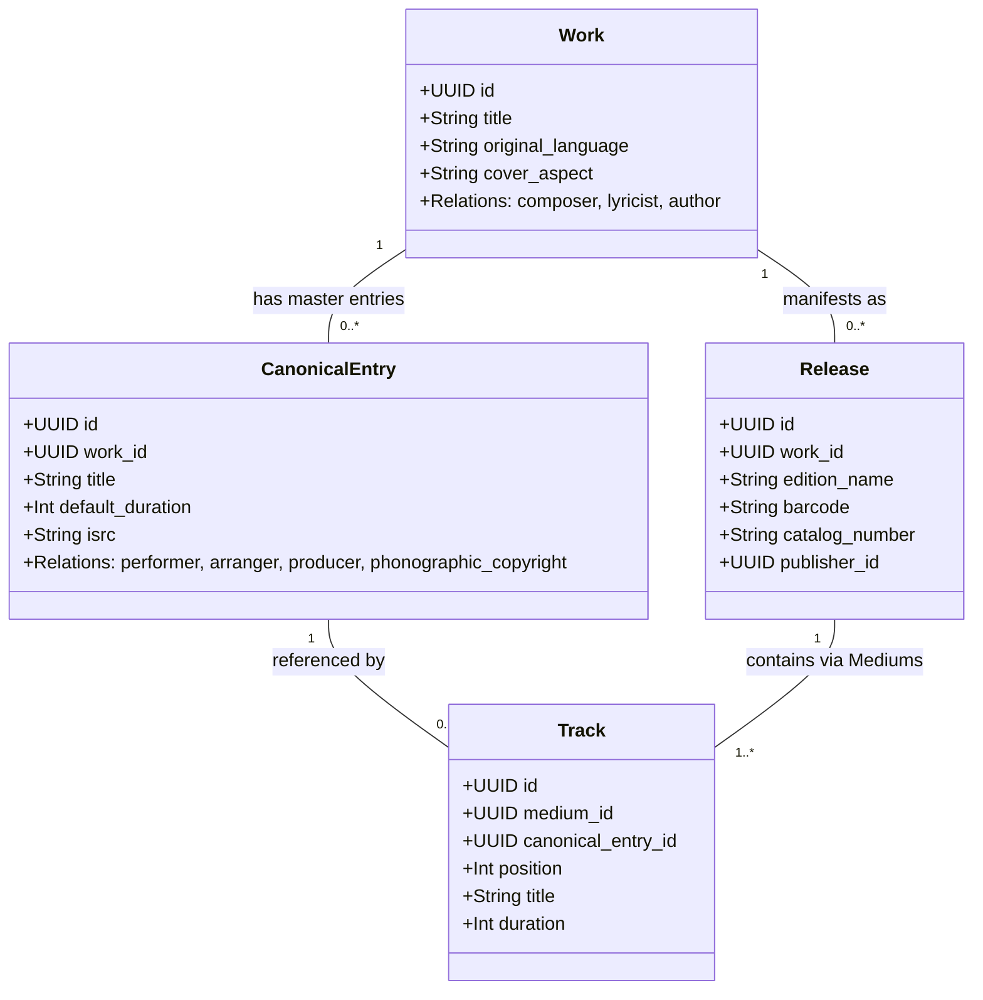
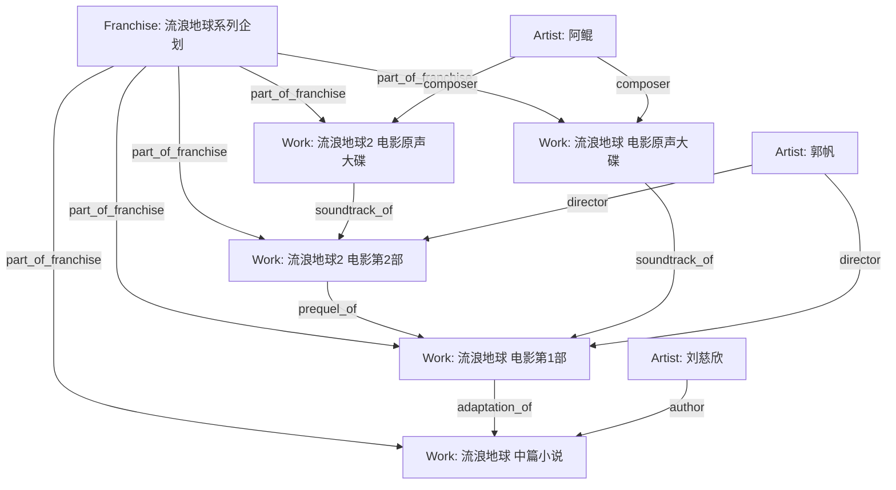
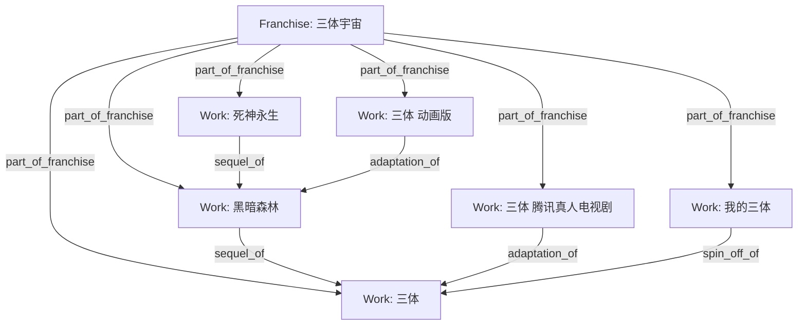

# MetaFusion LRM 增强版架构与实体拓扑规范 (LRM Architecture & Topology Reference)

## 1. IFLA LRM 实体模型在 MetaFusion 中的映射

MetaFusion 融合国际图书馆参考模型（IFLA LRM）与 MusicBrainz 编目哲学，将多媒体数据划分为 5 层结构与 4 大实体枢纽：

```
┌────────────────────────────────────────────────────────┐
│  LRM-E1: Work (逻辑作品概念层: 纯净题名与核心思想)       │
│  - 纯粹思想与艺术创作概念，如《千与千寻》《范特西》《三体》│
│  - 词曲创作绑定: composer, lyricist, author           │
└───────────────────────────┬────────────────────────────┘
                            │ 1:N 抽象创作演化为母版/录音
┌───────────────────────────▼────────────────────────────┐
│  LRM-E2: CanonicalEntry / Recording (典范母版/录音)    │
│  - 单曲母带、动画单集母版、漫画分话母版、游戏关卡母版 │
│  - 录音演职绑定: performer, arranger, producer         │
│  - 可被多个不同 Release / Track 跨版本复用            │
└───────────────────────────┬────────────────────────────┘
                            │ 1:N 商业发行封装 / 复用于多发行版
┌───────────────────────────▼────────────────────────────┐
│  LRM-E3: Release (商业发行版本 / 包装规格)             │
│  - 初回限定盘 CD+BD、4K UHD 铁盒版、精装单行本分卷     │
│  - 商业属性: barcode (ISBN/EAN), catalog_number, 厂牌 │
│    └─ Medium (介质容器: Disc 1, Disc 2, Vol.1)         │
│         └─ Track (物理分轨: 音轨序号、时长、母版引用) │
└───────────────────────────┬────────────────────────────┘
                            │ 1:N 数字化持久化
┌───────────────────────────▼────────────────────────────┐
│  LRM-E4: Item / AssetFile (实体单件与存储资产)          │
│  - RustFS / S3 对象存储、SHA-256 校验、HLS 切片流      │
└────────────────────────────────────────────────────────┘
```

---

## 2. 词曲创作与录音演职主体的严格分离与复用机制

### 2.1 创作者 (Work Level) 与 录音演职主体 (Recording Level)

在传统低精度数据库中，作词、作曲、编曲、演唱常被混为一谈。MetaFusion 实行严格的层次化演职隔离：



- **Work 级关系**：
  - `composer`（作曲者）：写出旋律与和弦的主体（如：周杰伦、久石让）；
  - `lyricist`（作词者）：创作歌词的主体（如：方文山、林夕）；
  - `author`（原著作者）：文学创作者（如：刘慈欣、尾田荣一郎）。
- **CanonicalEntry / Recording 级关系**：
  - `performer` / `vocalist`（演唱者/演奏者）：实际发声的主体；
  - `arranger`（编曲者）：将纯乐谱编配为完整配器编制的音乐人（如：钟兴民、林迈可）；
  - `producer`（录音制作人）：监制整个录音工程的主体；
  - `phonographic_copyright`（录音制品版权方 ℗）。

### 2.2 Recording 复用与「Appears on Releases」反查原理

当一首典范录音（如《晴天》2001 原版母带）在多个发行版中出现时：
1. **单次创建**：仅在库中保留一个具有全局唯一 UUID 的 `CanonicalEntry`（可包含 ISRC 编码）；
2. **多点引用**：
   - Release A（2001《叶惠美》首版 CD）的 Medium 1 Track 3 引用该 `CanonicalEntry`；
   - Release B（2004《Initial J》日本精选集）的 Medium 1 Track 1 引用同一个 `CanonicalEntry`；
   - Release C（2020《周杰伦20周年黑胶大套装》）的 Disc 4 Track 3 再次引用同一个 `CanonicalEntry`；
3. **反向索引**：系统无需冗余复制单曲元数据，通过 SQL `JOIN tracks ON tracks.canonical_entry_id = canonical_entries.id JOIN mediums ... JOIN releases ...` 即可实时反查出该母版录音收录于哪些商业发行版（Appears on Releases）。

---

## 3. 多作品合集与豪华盒装 (Multi-Work Boxsets) 深度案例解析

### 3.1 教学案例：宮崎駿監督作品集 (13BD Boxset) vs. 千与千寻单行本

```
[ 单行本 Release: VWBS-1530 ] ─────────► 属于单部作品 ─────────► [ Work: 千与千寻 ]
(1 BD-50, 日本院线初版)                                             ▲
                                                                    │
[ 13BD 豪华盒装 Release: VWBS-1531 ]                                 │
   ├── Medium 01: 鲁邦三世 卡里奥斯特罗之城 (BD) ── Track 1 ──► [ Work: 鲁邦三世 ]
   ├── Medium 02: 风之谷 (BD)                 ── Track 1 ──► [ Work: 风之谷 ]
   ├── Medium 03: 天空之城 (BD)               ── Track 1 ──► [ Work: 天空之城 ]
   ├── Medium 04: 龙猫 (BD)                   ── Track 1 ──► [ Work: 龙猫 ]
   ├── Medium 05: 魔女宅急便 (BD)             ── Track 1 ──► [ Work: 魔女宅急便 ]
   ├── Medium 06: 红猪 (BD)                   ── Track 1 ──► [ Work: 红猪 ]
   ├── Medium 07: 幽灵公主 (BD)               ── Track 1 ──► [ Work: 幽灵公主 ]
   ├── Medium 08: 千与千寻 (BD)               ── Track 1 ───┘ (精准回溯)
   ├── Medium 09: 哈尔的移动城堡 (BD)         ── Track 1 ──► [ Work: 哈尔的移动城堡 ]
   ├── Medium 10: 悬崖上的金鱼姬 (BD)         ── Track 1 ──► [ Work: 悬崖上的金鱼姬 ]
   ├── Medium 11: 起风了 (BD)                 ── Track 1 ──► [ Work: 起风了 ]
   ├── Medium 12: 特典盘 1 (On Your Mark & 宣传片)
   └── Medium 13: 特典盘 2 (引退记者会等)
```

- **严禁反例**：在《千与千寻》单部作品页面上填入 `catalog_number = "VWBS-1531"`（这是 13 碟大盒装，不是千与千寻单碟！）。
- **正解流程**：
  1. 《千与千寻》作品页挂载 `VWBS-1530` 单碟蓝光；
  2. 独立创建汇编作品《宮崎駿監督作品集》，其下挂载 `VWBS-1531` 发行版；
  3. 创建 13 个 Medium，Medium 8 的 Track 关联《千与千寻》电影母版；
  4. 建立图谱边 `千与千寻 included_in 宮崎駿監督作品集`。

---

## 4. 跨媒介世界观企划 Hub 与 DAG 拓扑图谱 (Franchise & DAG Topology)

### 4.1 《流浪地球》与《三体》跨媒介图谱典范

#### 案例 1：《流浪地球》系列世界观


#### 案例 2：《三体》三部曲与多媒介衍生


### 4.2 实体连接矩阵与拓扑约束 (Graph Connectivity Matrix)

| 源实体类型 (Source) | 目标实体类型 (Target) | 允许的关系类型 (`relationship_type`) | 语义约束与拓扑检测规则 |
|---|---|---|---|
| **Franchise** | **Franchise** | `part_of_franchise` | 企划嵌套（如 `FGO` 属于 `Fate 系列`） |
| **Work** | **Franchise** | `part_of_franchise` | 作品归属于企划 |
| **Work** | **Work** | `adaptation_of` (改编自)<br>`soundtrack_of` (原声带)<br>`sequel_of` (续作)<br>`prequel_of` (前作)<br>`spin_off_of` (衍生作品)<br>`included_in` (收录于合集)<br>`expansion_of` (DLC/资料片)<br>`remake_of` (重制自)<br>`crossover_with` (跨界联动) | **严格保持有向无环 (DAG)**。<br>- 禁止自环（`source_id != target_id`）<br>- 禁止 `sequel_of` 与 `prequel_of` 双向闭环<br>- `crossover_with` 为对称边（无需循环检测） |
| **Artist** | **Franchise** | `creator_of`, `imprint_of` | 企划创立者、旗下品牌/厂牌 |
| **Artist** | **Work** | 演职职能 (`director`, `author`, `composer`, `lyricist`, `illustrator`, etc.) + `character_in` | 艺术创作关系与角色出场 |
| **Artist** | **CanonicalEntry** | 录音制作职能 (`performer`, `arranger`, `producer`, `phonographic_copyright`) | 录音工程母版关系 |
| **Artist** | **Artist** | `voice_actor_of` (声优配音)<br>`member_of` (乐队/团体成员)<br>`real_counterpart_of` (现实对照乐队)<br>`alternate_form_of` (角色形态变体)<br>`imprint_of` (子厂牌) | 多边使用 `qualifier` 区分语种与版本 |

---

## 5. 消除 `media_type` 的多维表达体系

MetaFusion 坚决反对在主表强加 `media_type` 枚举。作品形态由四重维度正交决定：

1. **多维标签 (`tags`)**：
   - `format` 分组：`["动画", "电影"]`、`["音乐", "专辑"]`、`["轻小说"]`、`["漫画"]`、`["游戏"]`；
   - `genre` 分组：`["科幻", "赛博朋克"]`、`["交响配乐"]`、`["悬疑推理"]`；
2. **封面画幅 (`cover_aspect`)**：
   - `"1:1"` (音乐唱片/OST)；
   - `"2:3"` (电影/动画海报)；
   - `"3:4"` (书籍/漫画/单行本)；
3. **Release 载体规格**：
   - Medium `format`: `Paperback`, `Hardcover`, `CD`, `Vinyl`, `Blu-ray`, `UHD-BD`, `Digital Book`, `Digital Album`；
4. **实体图谱边 (`entity_relationships`)**：
   - 通过 `adaptation_of`、`soundtrack_of`、`spin_off_of` 自然表达媒介演变。
