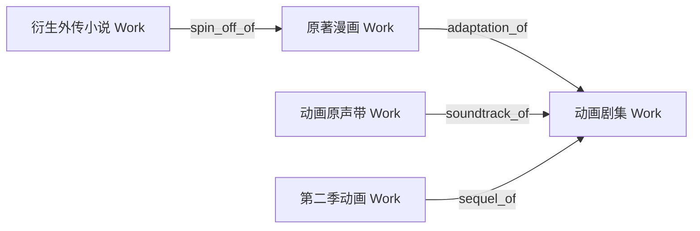

# MetaFusion 编目审查与数据质检规范 (QA & Review Checklist)

本文档定义 MetaFusion 考据员与自动化审查 Agent 进行元数据校验、巡检与合并的详细规则集。

---

## 1. 纯净题名审查 (Work Pure Title Inspection)

### 1.1 污染词汇黑名单拦截表
Work 题名若命中以下模式，判定为**不合规 (Dirty Title)**，必须驳回或执行清洗：

| 污染类型 | 违规模式 (Regex / Keyword) | 正确归宿 |
|---|---|---|
| **媒介/格式声明** | `TV(动画)?`, `剧场版`, `OVA`, `OAD`, `Web连载`, `单行本`, `漫画版`, `广播剧` | 移入 Work `tags` 或 Release 规格 |
| **季数与分卷** | `第[0-9一二三四]季`, `Season\s*\d+`, `Vol(ume)?\.\s*\d+`, `第[0-9]+卷` | 移入 Release `edition_name` |
| **分辨率与音质** | `1080[pP]`, `4[kK]`, `UHD`, `Hi-Res`, `24bit/96kHz`, `FLAC`, `MP3`, `DSD` | 移入 Medium / Asset 属性 |
| **压制/字幕组** | `\[.*?字幕组\]`, `\[.*?Rip\]`, `\[Web-DL\]`, `【.*?压制】` | 严禁入库，彻底剔除 |
| **发行限定词** | `初回限定[盘版]`, `通常[盘版]`, `完全生产限定`, `豪华版`, `Remaster(ed)?` | 移入 Release `edition_name` / `packaging` |

---

## 2. 封面合规性与画幅审查 (Cover Quality & Aspect QA)

```
       [ 1:1 ]                   [ 2:3 ]                  [ 3:4 ]
┌──────────────────┐      ┌──────────────────┐     ┌──────────────────┐
│                  │      │                  │     │                  │
│   Music / OST    │      │   Movie / Anime  │     │   Book / Comic   │
│   (Square Box)   │      │  (Vertical Poster│     │  (Book Cover)    │
│                  │      │                  │     │                  │
└──────────────────┘      │                  │     │                  │
                          └──────────────────┘     └──────────────────┘
```

- [ ] **比例一致性**：检查 `works.cover_aspect` 与实际图片的像素宽高比是否匹配（允许 ±5% 误差容限）；
- [ ] **画质分辨率**：
  - 1:1 图片 ≥ 1000x1000 px；
  - 2:3 图片 ≥ 1000x1500 px；
  - 3:4 图片 ≥ 1200x1600 px；
- [ ] **图源纯净度**：无第三方网站水印、无剧照截屏拼接、无模糊扫描畸变；
- [ ] **防占位图**：严禁出现默认空图、纯色背景图或写有“暂无封面”的图片。

---

## 3. 标准编码与标识符校验 (Barcode & External ID QA)

### 3.1 ISBN-13 模 10 校验算法
所有出版物 Release 的 `barcode` 必须为有效 ISBN-13：
$$\sum_{i=1}^{12} d_i \times (1 \text{ 或 } 3) + d_{13} \equiv 0 \pmod{10}$$

### 3.2 唱片编号 (Catalog Number) 规范
- 格式应为：`[厂牌代码]-[数字编号]`（如 `VICL-60017`, `SVWC-70001`, `KICA-2001`）；
- 严禁填写自定义描述文本（如“自购正版”）。

### 3.3 ISRC (国际标准录音制品编码)
- 格式：`CC-XXX-YY-NNNNN`（如 `JP-B01-20-00123`）；
- 必须与对应 Track 绑定。

---

## 4. 关系拓扑闭环与 DAG 校验 (Graph Topology & DAG QA)



- [ ] **有向无环性 (Acyclic Rule)**：作品间的 `sequel_of`、`prequel_of`、`adaptation_of` 绝不能形成闭环（如 A 是 B 的续作，B 又被指向为 A 的续作）；
- [ ] **禁止自引用 (No Self-Loop)**：`source_id != target_id`；
- [ ] **端点合法性**：严格满足连接矩阵（如 `soundtrack_of` 源端与宿端均必须为 Work）；
- [ ] **单实体原则**：同一人物的跨作品登场通过多条 `character_in` 关联，严禁分裂实体。

---

## 5. 实体消歧与去重合并流程 (Disambiguation & Merge QA)

当发现重复实体时，考据员应执行合并流水线：

```
[ 重复/待合并源实体 (Source UUID) ]
               │
               ▼  POST /api/v1/catalog/merge
[ 权威目标实体 (Target UUID) ]
               │
               ├── 1. 迁移全部 Releases、Mediums、Tracks
               ├── 2. 迁移全部 EntityRelationships（去重合并）
               ├── 3. 迁移全部 Translations（补全缺失语种）
               ├── 4. 迁移全部 物理资产与收藏记录
               └── 5. 源实体标记为 `merged` 并建立永久 301 重定向
```
- **保留原则**：优先保留创建时间更早、外部 ID（MusicBrainz / Bangumi / TMDB）更完整、修订历史更详实的实体作为 Target。
