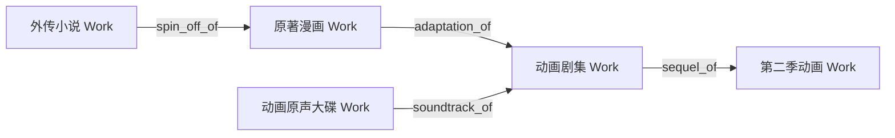

# 权威编目与元数据审查指引 (Curation & Review Guide)

MetaFusion 致力于构建一个客观、开放、高纯度且高度结构化的跨媒介知识图谱库。为了打破传统分类体系的信息污染与数据孤岛，全站采用 **IFLA LRM（国际图书馆参考模型）增强版架构** 与 **纯净实体理念 (Pure Entity Title)**。

本指引适用于所有在 MetaFusion 中进行实体创建、数据录入、多源导入与审查质检的社区考据员（Archivists）与 AI 代理（AI Agents）。

---

## 1. 核心四大枢纽与纯净实体准则

全库严格划分为四大独立成页的核心枢纽实体：

```
[ Franchise (世界观/企划枢纽) ] ─── part_of_franchise ───┐
                                                         ▼
[ Artist (责任主体: 创作者/机构) ] ─── creator_of ───► [ Work (逻辑作品概念层: 纯净题名) ]
                                                         │
                                                  1:N    │ 物化/出版发行
                                                         ▼
                                            [ Release (载体发行版本: 规格/厂牌/条码) ]
                                                         │
                                                  1:N    │ 盘片/分卷
                                                         ▼
                                              [ Medium (介质容器: Disc / Vol) ]
                                                         │
                                                  1:N    │ 单轨/分集
                                                         ▼
                                              [ Track (条目分轨: 章节/音频/路线) ]
```

### 1.1 纯净实体题名黄金准则 (Pure Entity Rule)

- **逻辑作品 (`Work`)**：只保留最纯粹的原作题名（如《进击的巨人》、《范特西》、《三体》、《攻壳机动队》）。
  - ❌ **严禁污染**：绝不掺杂媒介属性（如“TV动画”、“剧场版”）、分季分卷（如“第1季”、“Vol.1”）、音质画质（如“1080P”、“Hi-Res”、“24bit/96kHz”）、压制组信息或版本修饰词（如“Remastered”、“豪华版”）。
- **载体发行版 (`Release`)**：承载具体出版载体、出版方、分卷序号、限定规格、唱片编号或 ISBN-13。
  - ✅ **正例**：《进击的巨人 1：向两千年后的你（初版单行本，讲谈社，ISBN 9784063842760）》、《范特西（首版 CD，BMG 唱片）》、《全职高手 第一季（4K UHD 典藏蓝光BOX，腾讯视频）》。
  - ❌ **反例**：泛用模版复制（如所有网文都写“网络连载版”）、缺少版本区分。
- **责任主体 (`Artist`)**：人名、团体名、出版社、唱片厂牌均使用权威规范名（如“米哈游”、“新星出版社”、“久石让”、“周杰伦”），严禁混入职务或按作品重复创建。
- **跨媒介企划 (`Franchise`)**：聚合同一世界观跨媒介作品（如“三体宇宙”、“刀剑神域”、“Fate 系列”），严禁为个人作者全集或单部作品分服建立企划。

---

## 2. 跨媒介拓扑图谱与关系网络 (Graph Relationships)

实体间的关联通过有向语义边连接，**严格保持有向无环图 (DAG)**，杜绝自环与死循环：



### 2.1 常见语义关系谓词
- `adaptation_of`（改编自）：跨媒介改编（如漫画改编为动画、小说改编为电影）；
- `soundtrack_of`（原声带）：音乐作品作为影视/动画/游戏的原声音乐；
- `sequel_of` / `prequel_of`（续作 / 前作）：时间线与叙事延续作品；
- `spin_off_of`（衍生）：同一世界观下的外传/衍生创作；
- `included_in`（收录于）：单曲收录于专辑、短篇收录于文集；
- `expansion_of`（DLC / 资料片）：游戏扩展内容；
- `remake_of`（重制自）：完全重制版本。

### 2.2 角色与声优标准三元组
```
[ 声优 (Agent: Person) ] ── voice_actor_of (qualifier="ja") ──► [ 角色 (Agent: Virtual Character) ]
                                                                       │
                                                                       │ character_in
                                                                       ▼
                                                          [ 作品 / 企划 (Work / Franchise) ]
```
同一角色的跨作品登场通过多条 `character_in` 边连接，不同语言的配音通过 `qualifier` 标注，**严禁分裂角色实体**。

---

## 3. 封面资产规范与画幅比例 (Cover Standards)

MetaFusion 杜绝所有侵权、低质、截屏拼接与占位图，所有封面必须为官方原装出品并托管于平台持久化存储（RustFS / S3）：

| 媒介大类 | 强制比例 (`cover_aspect`) | 最低分辨率建议 | 说明 |
|---|---|---|---|
| **音乐 / 唱片 / OST** | `1:1` (方形) | ≥ 1000x1000 px | 正规专辑封面扫描件或官方高清数字发布封面 |
| **电影 / 动画 / 剧集** | `2:3` (竖向海报) | ≥ 1000x1500 px | 官方主视觉海报（Key Visual）或影院公映海报 |
| **书籍 / 漫画 / 文献** | `3:4` (标准书页) | ≥ 1200x1600 px | 出版社官方书封扫描件或官方电子书封面 |

---

## 4. 多语言与国际化本地化链条 (i18n Fallback)

所有主实体均支持多语言本地化：
1. **标注原语言 (`original_language`)**：如 `ja`, `zh-CN`, `en`, `ko`；
2. **多语言表 (`_translations`)**：维护 `zh-CN`（简体中文）、`zh-TW`（繁体中文）、`en-US`（英语）、`ja`（日语）、`ko`（韩语）各语种的题名与简介；
3. **回退链条机制**：系统优先呈现用户偏好语言的权威译名，未命中时平滑回退至英文或原生语言标题，杜绝乱码与机器生硬翻译。

---

## 5. 版本控制与不可篡改审计流 (Auditability & Revisions)

- **严禁匿名与不可追溯修改**：每次写操作或 API 提交必须携带：
  - `edit_note`：清晰阐述编辑原因与修订依据（如“根据新星出版社官方目录补充 ISBN-13 与装帧说明”）；
  - `source_urls`：提供真实可核验的考据链接（如官网介绍页、ISBN 数据库条目、MusicBrainz 链接）。
- **版本快照**：每次变更自动生成 `entity_revisions` 记录，支持社群比对（Diff）、历史审查与恶意修改一键回滚。

---

## 6. AI Agent 编目与自动化审查规范

所有参与 MetaFusion 元数据处理的 AI 代理必须加载并严格执行系统内置的 `.cursor/skills/metafusion-curator/` 技能包：

- **SOP 执行顺序**：权威源调研 -> 检索防重 -> 提取纯净题名 -> 构建 Release / Medium / Track 树 -> 绑定演职员与拓扑边 -> 校验封面与比例 -> 生成修订附注。
- **一站式提交**：优先调用 `POST /api/v1/catalog/submit` 事务接口，保障实体与关系的原子性创建。
- **巡检拦截**：对命中污染词汇黑名单、封面比例失真、缺少 ISBN 校验位或存在拓扑循环边的提交，自动予以拦截与纠正。
