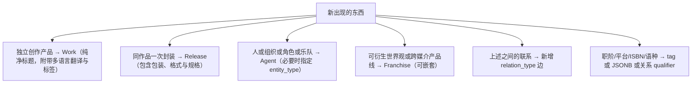

# IFLA LRM 增强版实体模型体系 (LRM-Enhanced)

MetaFusion 采用国际图书馆学联合会（IFLA）最新制定的 **LRM (Library Reference Model 图书馆参考模型)** 规范，并在其基础上融合了高解析无损音频抓轨、多码率切片流媒体与开放协同修订机制，构建了面向跨媒介（电影、音乐、剧集、文献、动漫、画集）的 **LRM 增强版分层数据架构**。

---

## 1. 核心分层架构

```
┌────────────────────────────────────────────────────────┐
│  LRM-E1: Work (作品概念层)                              │
│  - 纯粹的知识与艺术创作概念，如《千与千寻》《奥本海默》《BAD MODE》 │
└───────────────────────────┬────────────────────────────┘
                            │ 派生 / 表现
┌───────────────────────────▼────────────────────────────┐
│  LRM-E2: Expression (表现形式层)                        │
│  - 语种版本、原声/无损母带、导演剪辑版、分轨编目、曲目典范条目    │
└───────────────────────────┬────────────────────────────┘
                            │ 物化 / 出版发行
┌───────────────────────────▼────────────────────────────┐
│  LRM-E3: Manifestation / Release (载体发行版)           │
│  - 具体的物理或数字发行物 (初回限定盘、4K UHD 铁盒、SACD、数字专辑) │
│    └─ Medium (载体单元: Disc 1, Disc 2, Side A/B)       │
└───────────────────────────┬────────────────────────────┘
                            │ 单件 / 数字化存储
┌───────────────────────────▼────────────────────────────┐
│  LRM-E4: Item / Asset (物理单件与资源资产)               │
│  - 对象存储文件、SHA-256 校验哈希、分片流媒体切片、抓轨日志     │
└────────────────────────────────────────────────────────┘
```

同时，通过 **LRM-E5 Agent（责任主体）** 构建横跨全生命周期的创作者与制作机构协作关系图谱：

```
                    ┌──────────────────┐
                    │ LRM-E5: Agent    │
                    │ (创作者 / 机构)    │
                    └─────────┬────────┘
                              │ 承担职能 (Role)
             ┌────────────────┼────────────────┐
             │                │                │
      执导 / 谱曲 / 著作者     演奏 / 声优 / 演唱     出品 / 录音工作室 / 厂牌
             │                │                │
             ▼                ▼                ▼
       [ LRM-E1 Work ] ─── [ LRM-E2 Expr ] ─── [ LRM-E3 Release ]
```

---

## 2. LRM 实体层级详细职责

| 层级 | LRM 定义 | MetaFusion 平台职责 | 核心数据字段 | 典型示例 |
|---|---|---|---|---|
| **Work** | 作品概念 (LRM-E1) | 独立的精神与艺术创作概念，聚合所有翻唱、改编与重映版本 | `id (UUID)`, `title`, `original_title`, `translations`（按 locale 的题名+简介）, `language`（默认显示语种）, `original_language`, `summary`, `cover_image_url`, `cover_aspect`, `tags` | 《攻壳机动队》、《星际穿越》、《贝多芬第九交响曲》 |
| **Expression** | 表现形式 (LRM-E2) | 艺术概念的具体知觉实现（音频声道、画面规格、语言文本） | `canonical_entries`, `format`, `channels`, `sample_rate`, `bit_depth` | 24bit/96kHz Hi-Res 立体声母带、IMAX 1.43:1 动态画幅剪辑版 |
| **Manifestation (Release)** | 载体发行 (LRM-E3) | 面向公众的特定物理或数字出版载体形态，包含条码与唱片编号 | `edition_name`, `catalog_number`, `barcode`, `packaging`, `release_date`, `country` | `VIZL-123` 初回限定盘 (CD+Blu-ray)、`UHD-8848` 限量铁盒收藏版 |
| **Medium** | 载体介质 (LRM-E3 容器) | 复合发行版下的独立物理/数字存储盘片或分卷 | `position`, `format` (CD/BD/Vinyl/Digital/Book), `track_count` | `Disc 1 (Original CD)`, `Disc 2 (Bonus BD)`, `Side A` |
| **Track / Entry** | 条目/分轨 (LRM-E3 内容项) | 介质载体上的具体音轨、影片章节或书籍分册 | `position`, `title`, `duration`, `canonical_entry_id` | `Track 01: 谣 III - Reincarnation` (03:44) |
| **Item / Asset** | 实体单件/资产 (LRM-E4) | 存储节点上的具体数字化文件与物理特征 | `s3_key`, `file_size`, `sha256`, `mime_type`, `transcode_status` | `master_24_96.flac` (SHA256 校验完备) |
| **Agent** | 责任主体 (LRM-E5) | 参与创作、演出、制作、出版的个人或组织法人 | `name`, `type` (Person / Group / Studio / Orchestra), `aliases`, `country` | 克里斯托弗·诺兰、久石让、柏林爱乐乐团、吉卜力工作室 |

---

## 3. 为什么选择 LRM 增强版架构？

1. **避免跨媒介实体混淆**：
   - 传统的平面数据库往往将《千与千寻》电影、电影原声带 CD、主题曲单曲以及艺术画集混在同一张表内，导致字段大量冲突。
   - LRM 架构将《千与千寻》（电影 Work）与《千与千寻 电影原声大碟》（音乐 Work）清晰拆分为独立概念，并通过 `adaptation` / `soundtrack_of` 图谱关系边紧密互联。
2. **多语言与跨国版本无缝支持**：
   - 统一在 Work / Artist / Franchise 层提供 `translations` 表（`zh-CN` / `zh-TW` / `en-US` / `ja` / `ko`），每种语言同时保存题名与简介；主表 `title`/`summary`（或 `name`/`biography`）等于默认显示语种那一组。
3. **版本演进与不可篡改审计**：
   - 所有 LRM 实体的每一次创建、更新或合并，均记录于不可篡改的 `entity_revisions` 审计流中，支持完整的版本追溯、差异对比（Diff）与社群协作审核。
4. **MusicBrainz WS/2 无缝映射**：
   - 平台原生兼容 MusicBrainz WS/2 规范接口，支持自动化抓取器与主流编目工具一键导入作品、发行版与创作者数据（详见 [开发者 API 概览](/api-overview)）。

---

## 4. 稳定枢纽 + 动态类型

全库只保留四类可独立成页的实体。类型与关系走字典表，不随题材加第五枢纽。

| 枢纽 | 含义 | 不做什么 |
|---|---|---|
| **Franchise** | 企划 / 世界观 / 可嵌套子企划 | 个人作者曲库、单部游戏分服、轻小说分卷 |
| **Work** | 一部可独立指认的创作 | 国服客户端、ISBN 各异的卷册 |
| **Release** | 同作品的一次封装（分服、卷册、数字碟、初回盘） | 产品级分家的新作 |
| **Agent** | 人 / 团 / 社 / 厂牌 / 虚拟角色 / 虚拟乐队 | 职阶、CV 字符串、从者专用表 |

真正灵活的是核心字典与标签本体：`entity_type_definitions`（创作者类型）、`relation_types`（多维关系网络）与多维标签体系。实体的形态与规格通过「多维标签 + 虚拟货架 + Release 规格 + 实体图谱边」自然表达，无任何 `media_type` 字段侵入。JSONB（`catalog_metadata`、关系 `attributes`）与关系 `qualifier` 只放题材附属字段（分服代码、配音语种）。

### 4.1 新概念判定树



- **何时升级子 Franchise**：一条支线自己已经跨媒介（漫画+动画+游戏）→ 子企划；只是正传的卷册或一季续作 → 留在 Work / `sequel_of`。
- **个人创作者的作品全集不是 Franchise**。枢纽是 Agent 页。只有当作者造出可被多人衍生的世界观才建 Franchise，并用 `creator_of` 接到企划上。
- **CanonicalEntry**：可跨发行复用的内容母版（同一录音、同一漫画话、VN 一条路线）。不成页、不是第五枢纽。从者是 Agent。
- **同类多边**用 `qualifier`（日配 `ja` / 中配 `zh-CN`），不要为此拆实体。
- 新编目专辑收录用 `included_in`；`part_of_universe` 仅保留给未迁完的旧数据。

### 4.2 连接矩阵

行 = 起点，列 = 终点。Agent 列还可按 `entity_type` 收紧。

| | Franchise | Work | Agent | Release |
|---|---|---|---|---|
| Franchise | `part_of_franchise` 嵌套 | — | — | — |
| Work | `part_of_franchise` | 原声 / 改编 / 续作 / 收录 / DLC / 联动 | — | 外键 `work_id` |
| Agent | `creator_of` / `character_in` / `imprint_of` | 演职 + 图谱边 | CV / 成员 / 变体 / 现场对照 | 出版者 |
| CanonicalEntry | — | `included_in` | 曲目级演唱 | Track 引用 |

关系校验只认 `allowed_source_types` / `allowed_target_types`（可写枢纽名或 `entity_type` 码）。层级谓词（`is_hierarchical`）写入时拒绝自环与祖先环。

### 4.3 编目示例

**明日方舟**：企划 = Franchise；游戏本体 = Work `game`；国服/日服/国际服 = 同一 Work 下多条 Release（`country` + `catalog_metadata.server`）；终末地 = 另一 Game Work；官方漫画与网络未出版漫画各为 Comic Work；塞壬唱片 = Agent `label` + `imprint_of`；OST / 合作单曲 = Music Work，`soundtrack_of` 仅当真是游戏原声。

**BanG Dream!**：企划 = Franchise；游戏与各季动画各为 Work；2D 乐队 = `fictional_band`，现场声优乐队 = `group` + `real_counterpart_of`；角色与 CV 必须是三条实体 + 两条边：`person --voice_actor_of--> virtual_character --character_in--> work/franchise`，`qualifier` 区分语种。禁止只写简介字符串。

**Fate / FGO**：Fate 为父 Franchise，FGO 为子 Franchise；FSN 三条路线 = CanonicalEntry，不拆三部 Work；从者不建 Servant 表，职阶进标签或 `catalog_metadata`；Saber / Saber Alter = 两个角色 + `alternate_form_of`；DLC 卖成独立产品才用 `expansion_of`，分服仍是 Release。

**魔禁 / 超电磁炮**：镰池 = Agent，作者页聚合小说；学园都市 = 父 Franchise；旧约 22 卷 = **一部** Novel Work + 22 条 Release（ISBN 进 `edition_name` / `catalog_metadata.isbn`）；新约卷号重置 = 新 Work + `sequel_of`；超炮已跨媒介 → 子 Franchise；美琴跨作品登场 = 同一角色多条 `character_in`。

**个人创作者**：久石让 / wowaka 的枢纽是 Agent 页，不建「某某宇宙」Franchise。单曲 `included_in` 专辑；Vocaloid 曲指向虚拟歌手而非声库公司。Toby Fox 在共享世界观明确之前不必为 Undertale/Deltarune 建 Franchise。

在企划详情页中可直观查看嵌套的子企划、关联作品、演职人员及可视化关系图谱；编辑者可在词条管理界面中为企划关联作品与维护实体间关系。如需程序化操作，请查阅 [API 编目与实体管理](/api-edit)。

