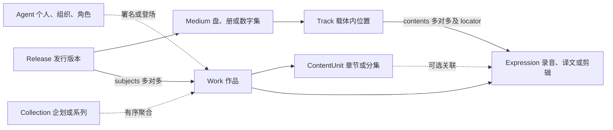

# 媒体架构、用户前端与服务边界评估

复核日期：2026-10-01。本文替代本文件原先的业务 types、定义草稿/发布/回滚快照，作为媒体建模与展示建议的维护入口。规范以[架构基准](./spec-driven-requirements.md)为准，服务归属以[拆分契约](./service-split-migration.md)为准，接口与字段以实际处理器和目标实例 definitions 为准。本次核查针对本地源码与隔离测试库，不代表已部署或已补录真实内容。

## 1. 结论与参考样本

当前八实体骨架足以保存问题中的作品、章节、表达、多发行版本、多载体和跨作品收录。确认的缺口集中在部分用户页面未充分消费已有结构、公开聚合读路径的可见性，以及教程、技能和工具仍沿用旧协议。先补齐这些问题，再考虑有真实样本证明必要的结构扩展。

2026-10-01 读取的参考页说明：

- [Bangumi 633836](https://bgm.tv/subject/633836) 是《Re:ゼロから始める異世界生活 4th season 奪還編》，有概览、章节、角色、制作人员、关联及按集限定的署名。角色和制作人员需要可导航的实体与带上下文的关系。
- [Bushiroad Music 入口](https://bushiroad-music.com/musics/) 分别按作品企划和艺人浏览。企划可用 Collection，艺人用 Agent，分别汇总其作品、发行和参与关系。
- [Split Single 商品页](https://bushiroad-music.com/musics/brmm-11112/) 列出 BRMM-11112 / BRMM-11113 两种 BD 限定盘。两版 CD 均收录 Poppin’Party 的「BRAVE JEWEL」翻唱和 Roselia 的「ときめきエクスペリエンス！」翻唱；A 版 BD 是台北演出，B 版 BD 是东京演出。初回卡、各店赠品、两版同时购买赠盒有不同条件。页面标示发售日为 2026-11-18，截至复核日仍是已公告的未来发行。
- [Pastel Aura 商品页](https://bushiroad-music.com/musics/brmm-11089/) 列出通常盘 BRMM-11090 与附五种立牌的限定盘 BRMM-11089，CD 均含五首歌，但售价和各店赠品不同。标示发售日为 2027-01-13；可以按公告建档，但不能把已公告当成已经上市。

以下地区版、黑胶、小说及电影例子是建模示意，不表示上述官方商品实际存在这些版本。

## 2. 八种身份：归属与收录分开

| 层级 | 例子与职责 | 编目边界 |
| --- | --- | --- |
| Agent | Roselia 团体、小说作者、动画角色各有身份 | 一个人的作曲、演唱、声优职位是关系，不是多个主体 |
| Collection | BanG Dream! 跨媒体企划、小说系列 | 企划不等于某张专辑；纯包装盒不必造作品 |
| Work | 歌曲、具有独立编排的专辑、一季动画、小说 | 同题名不等于同作品；歌曲与主打它的单曲商品分开 |
| ContentUnit | 小说第三章、动画第 78 话 | 同 Work 的稳定部分；独立歌曲不再复制成专辑的章节 |
| Expression | 某次录音、中文译文、导演剪辑 | 换介质或编码不自动产生新的创作表达 |
| Release | 通常盘、BD 限定盘、台湾发行、正式数字发布 | 同一公告页可能描述多个产品；来源 URL 不是商品唯一身份 |
| Medium | CD1、演出 BD、LP1、纸册、数字集 | 属于一个 Release；附赠 BD 与主 CD 有各自内容树 |
| Track | CD 第 2 轨、黑胶 A1、BD 章节、书中章节位置 | 载体内位置；contents 才说明实际收录哪个表达 |

`ContentUnit.parent_id` 必须同 Work，`Medium.parent_id` 必须同 Release，`Track.parent_id` 必须同 Medium，父子无环。Expression.work_id、Medium.release_id、Track.medium_id 是不可变归属。

Release 没有单一 work_id，须经 subjects 声明所有实际被收录表达所属的 Work。跨作品 CD/BD、精选集与盒装都遵循这一规则。subjects 和 contents 是收录事实的权威存储；`relationship_rules` 与 `/entities/{id}/links` 只读投影结构与语义关系，不能再复制一套可编辑外键事实。

## 3. 每类内容的完整例子

### 3.1 专辑：通常、限定、地区和不同介质

《Pastel Aura》建一个专辑 Work，用有序 includes 关联五首独立歌曲 Work，每首实际录音建 Expression。每个版本的实际内容分别存储：

| 示例版本 | Release | Medium 与实际收录 | 附赠 |
| --- | --- | --- | --- |
| 官方通常盘 | BRMM-11090、发售日、价格、发行者 | CD → 五个 Track → 各录音 Expression | 来源支持的封入卡与本版店铺赠品 |
| 官方立牌限定盘 | BRMM-11089、不同价格和版别 | CD → 同一组五首录音，复用 Expression | 五种立牌写 attachments，店铺赠品写 store_bonuses |
| 假设的 MV BD 限定版 | 新 Release、独立品番 | 主 CD + 附赠 BD；BD Track → MV 的 Expression | subjects 加入 MV Work，卡片仍是附件 |
| 假设的台湾发行版 | 独立地区、发行者、品番/条码 | 本版 CD 曲序；加曲增本版 Track | 地区、价格、译文和收录按来源填写 |
| 假设的黑胶版 | 独立 Release | LP1 Medium；面 A/B 可作父 Track，A1/B1 作子 Track | number 保留印刷编号，position 只决定顺序 |

CD 题名、印刷署名、时长与定位可能随发行不同，可写在 Track/收录属性；Expression 保留可复用的录音身份。确有重制声音/创作差异时另建 Expression，以 revision_of 或 GUI 新增的 remaster_of 联系原表达。

### 3.2 双乐队单曲：CD 相同，附赠 BD 不同

《BRAVE JEWEL / ときめきエクスペリエンス！》可有商品编排 Work，与两首歌曲 Work 建有序关系。两首翻唱分别是原歌曲 Work 下的新 Expression，保留表演者和 cover_of 来源关系。

限定 A、B 各一 Release；CD 的两个 TrackContent 复用相同录音。A 的 BD 指向台北演出 Work/Expression，B 的 BD 指向东京演出 Work/Expression，各自 subjects 声明相应作品。官方只公告整场演出时可先建整场 Track，未公布的 BD 章节或 setlist 不猜填。

随机卡记录随机条件和版本，单店赠品记录渠道/购买条件。两版同时购买赠盒不属于任意单版默认附件，可先在 store_bonuses.condition 原文记录。需要机器可读的跨商品活动时，可在 GUI 扩展字段组与 Release 引用；这不等于系统已经有促销规则引擎。

### 3.3 歌曲自身是作品，跨单曲、专辑和精选集收录

歌曲《示例歌曲》Work → 录音室 Expression E1。单曲 CD 第 1 轨、专辑 CD 第 4 轨、精选集黑胶 A2 的 contents 都引用 E1，各自拥有独立 Track/locator，三个 Release.subjects 都列入该歌曲 Work。

现场版 E2、翻唱版 E3、instrumental 或实质不同剪辑是不同 Expression；单曲 B 面是另一首歌，另建 Work。歌曲页“收录于”反查具体 Release/Medium/Track，发行页从 Track 回到录音与歌曲。单曲商品编排 Work 是可选的独立创作身份，不因每次上架而强制生成。

### 3.4 小说：卷章、译本和本版页码

《示例小说》Work 下建卷/章 ContentUnit 树，第三章分别关联日文正文 E1 与繁中译文 E2，用 translation_of 联系表达并署名译者。日文文库版和繁中平装版是不同 Release；纸册 Medium 的 TrackContent 指向本版表达，页码写 locator.page_start/page_end，relative_to=medium。

如果每卷有独立创作身份，系列 Collection 聚合多个卷 Work，每卷自有章节树。ContentUnit 不能跨 Work 挂父节点。电子书用章节/路径定位，不伪造纸本页码；字段与定位方案可在 GUI 配置。

### 3.5 动画：季、集、WEB、BD 和 DVD

参考 Bangumi 条目对应一季 Work，分集为 ContentUnit；编号、题名、逐集日期放在对应单元。多季有独立身份时由 Collection 聚合多个 Work。

配信原版与有内容修订的 BD 版分别建 Expression。正式网络发布、BD 盒装、DVD 版是不同 Release；每张盘或数字集是 Medium；TrackContent 指向本版实际集的 Expression。同剪辑仅换介质可复用表达。语言、字幕、时长与规格按 definitions 填；按集的编剧/导演关系连到 ContentUnit，角色用 Agent 与 character_in，配音用 character/language/context 区分。

### 3.6 电影：剪辑与文件来源

《示例电影》Work 可没有 ContentUnit。院线剪辑 E1、导演剪辑 E2 是 Expression，正式 WEB、BD、DVD 产品分别建 Release/Medium。BD 含幕后访谈或 MV 时建立其 Work/Expression，并补 subjects。

WEB-DL、REMUX、1080p HEVC、某压制组文件是资源来源/技术规格。只有对应真实公开发布形态时才建 Release，重新编码不造新作品/剪辑。文件、哈希、权限、绑定归 storage；目录 locator 不保存对象存储物理路径。新增目录字段不会自动获得技术分析或转码执行能力。

### 3.7 企划、人物、角色、写真与游戏

BanG Dream! 类企划用 Collection 聚合动画、音乐和演出 Work；艺人 Agent 汇总参与和成员关系。个人写真无需商业发行即可建作者 Agent 与写真 Work，有公开版本再补 Release。游戏路线用 ContentUnit，有实际内容差异的正文用 Expression，不同平台公开产品用 Release。描述性分类用开放标签，不能为适配媒体强塞不准确的旧业务类型。

## 4. 后台 GUI 扩展范围

当前没有实体业务 types。可写属性由 fields.<code>.applicable_kinds 决定，标签不决定字段集。DefinitionsEditor 可维护 fields、vocabularies、relations、templates、schemes 及固定结构的显示名称。

新增“重制自”关系的操作：

1. 在 /admin 定义管理添加稳定码 remaster_of，填写四语正向名、反向名和显示分组名。
2. 两端选 Expression，按语义设置无环性、基数、署名/聚合选项；附加信息引用已声明字段。
3. 用影响检查回放既有实体与关系；提交完整 document、当前 expected_etag、编辑说明与来源，服务端事务内复检并替换生效配置。
4. 在实体关系编辑器连接 E2→E1，详情按服务端名称/分组展示，无需修改前端关系码清单。

新的载体格式词项、页码/时间码子字段、展示顺序均可经 GUI 配置。固定八骨架、外键、收录容器和字段值类型是代码边界，不能在 GUI 新增第九种骨架或让 Track 跨 Medium。

若需要稳定区分歌曲、专辑、小说和电影，可经 GUI 新建一个可选枚举字段及词表，适用层级选 Work；词项由管理员维护，旧记录依据来源逐项补值。开放标签仍用于主题与描述，不作为身份或合并依据。当前模板按 kind 筛候选，再按已有属性评分；同分回退通用展示。GUI 可以调整字段、分区与顺序，尚不能任意编写新页面布局，也没有按分类词项约束关系端点的规则。后续确有需要时，优先增加有限、可预检的模板选择条件，避免把媒体名称写进代码分支。

ETag 只防并发覆盖，不是定义版本。当前没有定义历史、服务端草稿、差异或回滚端点。未使用的定义可删除，停用项能否删除须看实际影响检查；不要用旧“必须保留所有停用定义”口号替代当前校验。

## 5. 用户前端：已有能力与本轮修复

八实体规范地址统一为 /catalog/[id]，kind 只选择布局。Work 内容目录、Release 专用逐碟布局、TOC 快照、表达批量详情、版本对比和动态关系编辑已存在，不应按旧 /works、/releases、/mediums 再开发一套。

| 确认问题 | 修复与意义 |
| --- | --- |
| Medium 通用详情只有 Track 卡片，Track 自身不能完整浏览 contents | 补表达链接、页码/时间码与收录附加属性，逐个位置可追溯实际内容 |
| 子章节/子载体/子轨及轨树顺序展示不足 | 补父子导航与排序，保留正式 number |
| 收录反查从 Release 读格式 | 改从实际 Medium 读格式并链接 Track；CD/黑胶/BD 不再混淆 |
| Compare 不充分呈现定位与附加属性 | 对比逐轨定位及收录属性，载体格式走词表本地化 |
| Compare 的四类差异摘要仍读取旧 release 响应键，特定对比整页报错 | 改为当前 entity 键，中英实测同表达不同定位的对比恢复 |
| 切换条目或登录身份后，旧请求可能回写先前资料 | 详情与作品目录读取按条目、身份隔离，请求序号与缓存键阻止晚到响应覆盖当前页面；对比页登出立即清除私有名称 |
| 目录、关系或反向收录读取失败时被吞成空集合 | 显示部分资料读取失败与重试提示，保留已成功读取的内容，不以故障证明尚未编目 |
| GUI 结构字段标签没有完整消费 definitions 名称 | 改为服务端四语标签，后台改名可反映到编辑器 |
| 大目录逐行解析表达会产生大量请求，失败后引用难以恢复 | 去重后按最多 500 个一片批量读取，最多两片并发；保留定位信息并提供明确重试 |
| 下架 Expression 被公开反查、兄弟收录、对比或 Track 历史快照返回 | 统一表达当前可见性过滤，修订快照批量裁剪，保护隐藏引用及其 locator/属性，底层事实保留 |
| 裁剪后的公开视图被整实体 PUT 保存可能删去隐藏事实 | 普通编辑者删改不可见历史收录返回 forbidden，有权查看完整事实的创建者或审核者处理 |
| 交换导出把所有读取错误当 404，部分 JSON 类型故障会外发内部字段名 | 不存在/不可见仍为 404，数据库与内部反序列化故障返回通用 500；身份批量解析遇故障整批失败 |
| 教程和技能教写 types、旧 URL 与定义草稿/发布/回滚 | 同步字段适用范围、规范路由与单份定义保存协议 |

发行列表的 format 分面是从 Medium 派生的合法筛选，保留 CD+BD 按任一介质匹配；不能误删，也不能把 format 写进 Release 属性。

下一步产品优先级：作品页突出内容、版本、参与者；发行选择显示品番、地区、日期、实际载体；对比区分同录音换轨位、换录音、额外 BD、仅特典差异。staff/角色可沿现有关系分组增加筛选与按集展开。大目录先复用现有分页、TOC 和批量读取，再按实际测量优化虚拟列表。429/5xx 应有可重试错误状态，不应说成“尚未编目”。缺失曲目、封面或来源属于数据质量，须按来源补录。

## 6. 拆分策略评估

目录保持模块化核心合理：作品、表达、发行和收录需要同一事务校验。按音乐/小说/影视拆微服务会让主题曲、跨媒体企划和 BD 附赠变成分布式一致性问题。Auth、Community、Storage 按数据所有权拆开也合理；目前属于同源网关与主编排组合的渐进拆分。

| 现状与演进取舍 | 建议及验收 |
| --- | --- |
| 网关矩阵已单源于 deploy/nginx.conf，网关仓保留切流自检 | 保持一个生效源；路径登记、服务标记头与构建输入一起验收，搬仓不是目的 |
| 独立 DB 角色，共享 PostgreSQL 故障域 | 按恢复窗口、容量与连接压力决定物理分库，不为“微服务”名称复制数据库 |
| 目录启动已只读；其他服务仍在启动迁移/建表 | 逐域拆显式迁移命令与只读兼容性检查，验证后撤销运行角色 DDL，不能先撤权 |
| audit.audit_log 是有意共享的例外 | 继续维护 DDL/权限一致性检查；共享表需明确生命周期，不能声称完全无跨域对象 |
| Community/Storage 同步询问可见性和身份别名 | 隐私判定实时且 fail closed，故障 503、不可见 404；用 canonical_id 和完整 aliases 聚合 |
| outbox 无运行中的跨服务消费者 | 当前正确性靠同步身份解析；未来事件消费者须有幂等、重放、积压告警和恢复 |
| JWT/上游客户端各仓实现，SDK 尚未接入 | 先冻结 claims、错误码、超时并做契约检查，只抽稳定协议并以版本依赖引入 |
| 主仓 importer 与独立 CLI 并存 | 当前来源抓取在主仓，CLI 是 sourceGraph 执行器；来源映射与恢复验收前不退役现有入口 |
| UI 分散在主站、三个独立管理台和账号应用 | 共享稳定设计令牌/导航协议，避免复制 shell；按实际发布频率迁页，无须强拆用户详情 |
| 初次评估时发布锁与工作分支/dirty 状态不同 | 部署前选定验证组合；不能自动把 versions.lock 改成最新 HEAD 冒充验证 |

离线检查确认网关矩阵、编排、环境、审计 DDL 与文档端点检查有效。初次评估时工作 checkout 与发布锚点有差异。远端整合后，已对当前主分支组合进行本地测试、跨仓契约检查及兄弟仓 CI 验证，再更新发布锁；版本锁检查为 0 个问题、0 项跳过。目标实例仍需另行部署验收。

## 7. 技能和工作树

curator 负责实例编目/API 操作，lrm-catalog-standards 负责身份/层级判断。技能入口保留决策和参考路由，模型、API 行为、来源规范和 QA 各有一个维护位置，减少重复协议清单。

本轮纠正非 200 都算不存在、旧业务类型近似指导以及硬编码全零审计结论。404 表示不存在/不可见；401/403 是凭据/权限问题，429 要退避，5xx 是故障。工具未检查的项目须明确标记；非原子合并不能冒用 self 来源或忽略删除失败继续写入。

技能同步单份 definitions/ETag、真实修订形状、Picture 资产与图片版本字段、所有 kind 的 Compare 响应和可配置限流；限流计数仍按副本独立，不能因配置存在数据库就声称共享计数。导入来源已有 Bangumi、DLsite、DMM，以 /importer/sources 为准；Preview 的 auto 自动识别来源，Import 应回传预览中的明确 source。GUI 可补字段的种子缺项与固定结构限制分别说明，不再指导用其它关系日期、附件、重叠曲序或复制表达凑事实。

工作树清理同时检查 tracked/untracked/ignored 文件、独有提交、分支占用、锁和其他任务引用。干净且已合入的 detached 树仅是清理候选；占用 main、有独有提交或用户改动的树应保留。git worktree prune --dry-run 只判断过期登记，不代表仍存在的 checkout 可以删除。具体本机路径和当前分支状态只记 docs-local，不作为跨部署契约。

## 8. 验证与交付边界

本轮读路径风险以隔离 PostgreSQL 17 真实回归验证，并跑 Go 1.26 test/vet/build；CI 使用 PostgreSQL 16，版本差异仍以 CI 验收。Windows 缺少 GCC 且 CGO 未启用，race 检查实际尝试后未能运行，留由 CI 执行。前端通过 TypeScript、生产构建与四语文案检查，并以本地模拟数据浏览中英文页面：实际核验曲目/表达链接与对比页，501 个表达分成 500+1 两批，503 后重试恢复且无逐表达 GET；核验元数据 503 的部分失败提示、已读内容保留和重试，以及 14 秒父/子目录慢响应在登出后不能覆盖访客页面。作品目录另有执行生产 hook 的状态回归，覆盖登出、同作品换账号、晚响应和清空条目。文档站通过导航和构建；技能通过语法、引用、技能验证器、17 个隔离工具回归与 4 个客户端回归。网关矩阵、编排、环境矩阵、审计 DDL、Compose 配置和网关切流脚本离线自检通过，文档路由检查无 P1；初次评估时版本锁检查因工作分支与发布锚点不同未通过；远端整合后按实际验证过的组合刷新锚点，版本锁、环境、审计与生成契约检查均通过。构建与本地回归不能替代目标实例迁移/部署后的验收。

代码修复不会自动更新实例 definitions、镜像或内容数据。真实曲目、特典、地区与逐集 staff 仍需依据官方来源，按目标实例 ETag/version 另行执行补录与回读。
