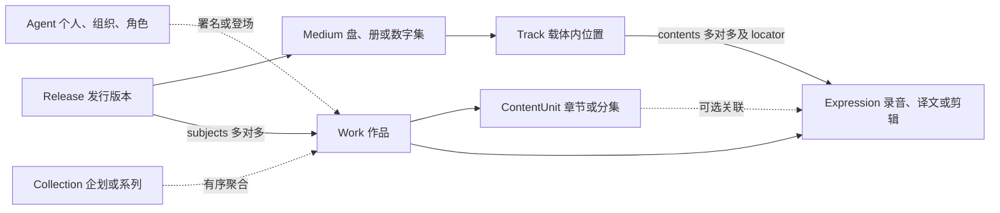

# 媒体编目与展示

本文维护实体身份判据、跨媒体建模例子与展示要求。固定模型见[架构基准](./spec-driven-requirements.md)，字段与读取契约见[核心实现](./catalog-core-implementation.md)，操作步骤见[公开编目教程](https://github.com/MoeclubM/metafusion-docs/blob/main/docs/catalog.md)。例子说明结构选择，真实条目须按当前来源建档。

## 1. 身份判据

| 记录方式 | 何时使用 | 例子 |
| --- | --- | --- |
| 实体 | 有持续身份，可独立修订、引用、合并或复用 | 游戏 Work、路线 ContentUnit、实际发行 Release |
| 属性 | 标量或小型结构，通常不需独立生命周期 | 日期、语言、时长、品番 |
| 词表项 | 需要统一取值和四语名称，不需独立事实关系 | 载体格式、图片用途 |
| 结构关系 | 表达归属、目录位置或有序收录 | 章节属于作品、轨位收录表达 |
| 语义关系 | 两端有独立身份，连接不改变所有权 | 配乐用于游戏、改编自、演员出演角色 |

先查外部 ID、合并重定向、同作品下的稳定标识和来源。题名相近只生成待核对候选，不能自动合并。译名、平台、介质、销售地区或修订日期本身不产生新 Work；实质内容变化才考虑新 Expression，公开产品或发行条件变化才考虑新 Release。只有可独立编目的组成创作才建另一 Work，不为填满层级造空节点。

来源 URL 也不是产品的唯一身份：一个商品页可同时描述多个版本。以 [Bushiroad Music 商品目录](https://bushiroad-music.com/musics/) 和 [Bangumi 条目](https://bgm.tv/subject/633836) 为例，应分别核对商品标识、载体、实际内容与逐集署名；公告中的未来发行可以建档，但不能记为已经上市。

## 2. 归属与收录分开

| 身份 | 示例与边界 |
| --- | --- |
| Agent | 艺人、作者、角色各有身份；同一人的作曲、演唱或声优职位是关系 |
| Collection | 跨媒体企划、系列；企划不等于专辑，包装盒不必造作品 |
| Work | 歌曲、独立编排的专辑、一季动画、小说；歌曲与主打它的单曲商品分开 |
| ContentUnit | 稳定章节、分集或路线；独立歌曲不复制成专辑章节 |
| Expression | 某次录音、译文、剪辑；换介质或编码不自动产生新表达 |
| Release | 通常盘、限定盘、地区产品、正式数字发布 |
| Medium | CD1、演出 BD、纸册、数字集；附赠 BD 与主 CD 各有内容树 |
| Track | CD 第 2 轨、LP A1、BD 章节、书中位置；contents 说明实际收录的表达 |

ContentUnit 父子必须同 Work，Medium 父子同 Release，Track 父子同 Medium，均不得成环。Expression.work_id、Medium.release_id、Track.medium_id 是不可变归属。

Release 没有单一 work_id，通过 subjects 声明所收录表达的 Work。多个 subjects 不产生多个父 Work，Track 引用外部歌曲也不改变其归属。subjects 和 contents 是唯一收录事实，统一关系 API 只读投影，不复制可编辑外键。

## 3. 跨媒体建模例子

### 3.1 专辑：通常、限定、地区与介质

示例专辑建一个 Work，以有序 includes 关联独立歌曲 Work；每次实际录音有可复用 Expression。

| 示例版本 | Release 的独立事实 | Medium 与实际收录 |
| --- | --- | --- |
| 通常盘 | 品番、发行者、日期与来源 | CD → Track → 各录音 Expression |
| 限定盘 | 品番、版别与附件条件 | 相同 CD 内容复用录音；新增 BD 单独建内容树 |
| 地区发行 | 地区、发行者、标识与本版收录 | 本版曲序与加曲，不复制旧版 Track |
| 黑胶版 | 独立公开产品 | LP Medium，A/B 面可作父 Track，A1/B1 为子 Track |

CD 印刷题名、署名、时长与定位可随发行变化，写入对应 Track 或收录属性。number 保留印刷编号，position 只决定顺序。确有重制声音或创作差异才另建 Expression，并通过已有或新声明的关系连接原表达。

### 3.2 双乐队单曲：CD 相同，附赠 BD 不同

商品编排 Work 可与两首歌曲 Work 建有序关系，翻唱属于原歌曲 Work 下的新 Expression，并保留表演者与来源。A、B 两版各建 Release，共用 CD 录音，各自 BD 指向对应演出 Work/Expression，subjects 补齐实际作品。

官方只公告整场演出时，可先建整场 Track，未公开的章节或 setlist 不猜填。随机卡记录随机条件与版本，单店赠品记录渠道与购买条件；两版同时购买赠盒不属于任意单版默认附件，可在 store_bonuses.condition 保留来源原文。可配置字段不意味着已有促销规则引擎。

### 3.3 歌曲跨单曲、专辑与精选集

歌曲 Work 的录音 E1 可被单曲 CD 第 1 轨、专辑 CD 第 4 轨和精选集 LP A2 共同引用。三处有独立 Track/locator，三个 Release.subjects 都包含歌曲 Work。

现场、翻唱或实质不同剪辑使用新的 Expression；单曲 B 面是另一首歌则另建 Work。歌曲页反查具体 Release/Medium/Track，发行页从 Track 导航到录音与歌曲。商品编排 Work 仅在确有独立创作身份时建立。

### 3.4 小说：卷章、译本与本版页码

小说 Work 下建卷章 ContentUnit 树，某章分别关联原文和译文 Expression，以 translation_of 联系并署名译者。原文文库与译文平装为不同 Release，纸册 Medium 的 TrackContent 引用本版表达，页码存 locator.page_start/page_end、relative_to=medium。

独立卷可各有 Work，由系列 Collection 聚合；ContentUnit 不能跨 Work 挂父节点。电子书用章节或路径定位，不伪造纸本页码，定位字段按 definitions 配置。

### 3.5 动画：季、集、WEB、BD 与 DVD

具有独立身份的一季用 Work，分集为 ContentUnit；编号、题名与逐集日期放在对应单元，多季由 Collection 聚合。原版与有实质修订的 BD 版分别用 Expression，同剪辑仅换介质可复用。

正式网络发布、BD 盒装和 DVD 为不同 Release，盘或数字集为 Medium，contents 指向实际分集表达。逐集编剧或导演连到 ContentUnit，角色为 Agent；配音通过声明的 character/language/context 区分。

### 3.6 电影：剪辑与文件来源

电影 Work 可没有 ContentUnit；院线版与导演剪辑为 Expression，正式 WEB、BD、DVD 产品各有 Release/Medium。附带访谈或 MV 有独立 Work/Expression，subjects 补齐。

WEB-DL、REMUX、1080p HEVC 或压制组文件说明资源来源与技术规格。仅对应真实公开发布形态时建立 Release，重新编码不造新作品或剪辑。文件、哈希、访问权限和绑定归存储服务，locator 不保存物理路径；新增目录字段不会自动获得技术分析或转码能力。

### 3.7 企划、人物、写真与游戏

跨媒体企划用 Collection 聚合动画、音乐和演出 Work，Agent 汇总参与和成员关系。个人写真无需商业发行即可建立作者与 Work，有实际公开版本再补 Release。

游戏稳定路线、章节或任务可用同 Work 的 ContentUnit；有实质差异的内容用 Expression，不同平台公开产品用 Release。配乐是独立 Work，通过 soundtrack_of 连接。平台只有在需要独立身份、历史和多种关系的真实样本出现后，才讨论新增身份。通用游戏不自动分类为独立游戏，也不从类别推断存在路线。

## 4. 定义与展示边界

后台可配置字段、词表、语义关系、方案、模板及结构显示名；可写属性只由 applicable_kinds 决定。固定八骨架、外键、收录容器和字段值类型属于代码契约，不能仅经 GUI 新增骨架或跨域归属。新关系需要稳定码、四语名称、合法端点和约束，先影响预检再以当前 ETag 保存。模板选择、区块和表达组合的实现细节见核心实现。

展示须遵守以下规则：

- 八实体共用 `/catalog/[id]`，目录、内容表达、版本和收录位置用不同名称，不为不同媒体重复建地址或事实。
- 无可见内容时隐藏空目录；读取失败显示重试并保留已成功部分，不能据此认定尚未编目。
- 收录与比较保留定位、附加属性和实际 Medium 格式；发行 format 分面由载体派生，不能写成 Release 属性。
- 切换条目或身份后，旧请求不得覆盖当前内容，私有缓存随身份改变清除。
- 大目录复用分页、TOC 和去重批量读取；隐藏引用及其属性、locator 和历史快照统一裁剪，公开视图不能覆盖隐藏事实。
- 小说或数字出版物使用中性的载体、收录位置与内容表达术语，不因缺少音乐轨道显示“没有内容”。

## 5. 验证与数据补录

回归覆盖多版本 CD+BD、跨专辑歌曲、小说章节、动画分集和电影剪辑的保存、回读、修改与比较，并检查分页、读取失败、身份切换、隐藏表达及历史收录保护。按[项目验证规则](../../AGENTS.md#4-按改动范围验证)运行必要检查，浏览器核中英文及窄屏布局。

代码变更不会自动更新实例 definitions 或内容。真实曲目、特典、地区与逐集 staff 须按来源、目标实例 ETag/version 补录并回读；涉及结构或线上数据时执行[部署与恢复手册](./deployment-runbook.md)的备份、账本、引用体检和对象验收。实例发布证据只记 docs-local。
